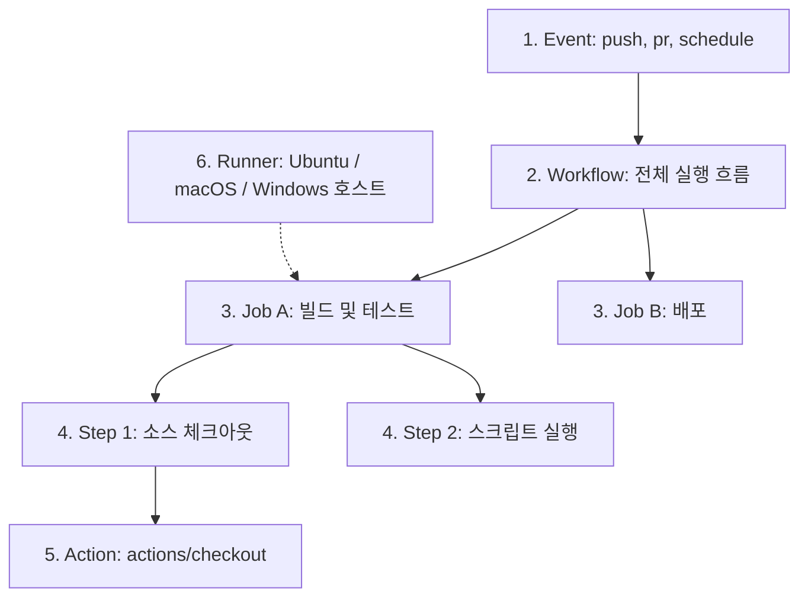

<!-- version: v1.0.0 -->
# 🐙 GitHub Actions 종합 가이드 및 실전 예시

GitHub Actions는 소프트웨어 개발 워크플로우를 자동화, 사용자 정의 및 실행할 수 있게 해주는 강력한 CI/CD(지속적 통합 및 지속적 제공) 플랫폼입니다. 코드 테스트, 빌드, 릴리즈 및 배포 단계를 리포지토리 안에서 손쉽게 처리할 수 있습니다.

---

## 📋 목차
1. [핵심 개념 이해](#1-핵심-개념-이해)
2. [기본 워크플로우 문법 구조 (YAML)](#2-기본-워크플로우-문법-구조-yaml)
3. [실전 활용 예시](#3-실전-활용-예시)
4. [보안 관리 및 Secrets 활용](#4-보안-관리-및-secrets-활용)
5. [고급 최적화 기법](#5-고급-최적화-기법)
6. [트러블슈팅 및 디버깅](#6-트러블슈팅-및-디버깅)

---

## 1. 핵심 개념 이해

GitHub Actions의 동작 과정을 이해하기 위해 필수적인 구성 요소들입니다.



* **Event (이벤트)**: 워크플로우를 실행하도록 트리거하는 특정 활동입니다. (예: `push`, `pull_request`, 주기적 실행을 위한 `schedule`, 수동 구동용 `workflow_dispatch`)
* **Workflow (워크플로우)**: 리포지토리에 추가하는 자동화된 절차의 전체 단위입니다. `.github/workflows/` 디렉토리에 YAML 파일로 작성됩니다.
* **Job (작업)**: 동일한 러너(Runner)에서 실행되는 일련의 **Step**들의 집합입니다. 기본적으로 여러 Job들은 병렬로 실행되지만, 의존 관계(`needs`)를 설정해 순차 실행도 가능합니다.
* **Step (단계)**: Job 안에서 순차적으로 실행되는 개별 명령어 또는 태스크 단위입니다. 쉘 명령어를 실행하거나, 미리 제작된 **Action**을 실행합니다.
* **Action (액션)**: 워크플로우 내에서 자주 반복되는 복잡한 작업을 패키징해 둔 재사용 가능한 구성 요소입니다. (예: 코드 체크아웃용 `actions/checkout`, 언어 셋업용 `actions/setup-python` 등)
* **Runner (러너)**: 워크플로우의 Job들을 실행하는 가상 머신(VM) 또는 서버입니다. GitHub가 호스팅해 주는 러너(Ubuntu, Windows, macOS)를 기본으로 쓰며, 자체 물리 서버를 러너로 등록할 수도 있습니다 (Self-hosted runner).

---

## 2. 기본 워크플로우 문법 구조 (YAML)

간단한 빌드 워크플로우 예시를 통해 핵심 문법을 파악합니다.

```yaml
# 워크플로우의 이름 (GitHub Actions 탭에 표시됨)
name: Node.js CI

# 트리거 조건 설정 (언제 실행할 것인가?)
on:
  push:
    branches: [ "main", "develop" ]
  pull_request:
    branches: [ "main" ]

# 가상 머신 권한 상세 설정
permissions:
  contents: read

# 구동할 실제 작업들
jobs:
  build-and-test:
    # 실행 환경 (OS 지정)
    runs-on: ubuntu-latest

    # Job 내에서 차례대로 수행할 단계들
    steps:
      # 1. 리포지토리의 소스코드를 VM으로 체크아웃
      - name: Checkout Source Code
        uses: actions/checkout@v4

      # 2. 가상머신에 Node.js 환경 구축
      - name: Set up Node.js
        uses: actions/setup-node@v4
        with:
          node-version: '20'
          cache: 'npm'

      # 3. 의존성 패키지 설치
      - name: Install dependencies
        run: npm ci

      # 4. 테스트 코드 실행
      - name: Run Test Suites
        run: npm test
```

---

## 3. 실전 활용 예시

### 예시 A: 문서 자동 갱신 및 커밋 푸시 (본 프로젝트 적용 예시)
작성한 가이드 문서를 수정하여 `push`하면 파이썬 스크립트(`update_readme.py`)를 가동해 `README.md` 내의 최종 수정일과 버전을 자동 업데이트하고 커밋/푸시까지 수행하는 CI 파이프라인입니다.

* **경로**: `.github/workflows/update-readme.yml`

```yaml
name: Update README Dates and Versions

on:
  push:
    branches:
      - main
      - master
    paths:
      - 'setup/**/*.md'
      - 'antigravity/**/*.md'
      - 'docker/**/*.md'
      - 'docs/**/*.md'

permissions:
  contents: write # 리포지토리에 쓰기 권한이 있어야 git push가 작동합니다.

jobs:
  update-readme:
    runs-on: ubuntu-latest

    steps:
      - name: Checkout repository
        uses: actions/checkout@v4
        with:
          fetch-depth: 0 # Git 전체 히스토리를 가져와서 파일의 마지막 커밋 정보를 식별합니다.

      - name: Set up Python
        uses: actions/setup-python@v5
        with:
          python-version: '3.x'

      - name: Run update script
        run: python update_readme.py

      - name: Commit and push changes
        run: |
          git config --global user.name "github-actions[bot]"
          git config --global user.email "41898282+github-actions[bot]@users.noreply.github.com"
          
          # 변경된 내역이 있을 때만 커밋 및 푸시 수행
          if git diff --quiet README.md; then
            echo "No changes to README.md"
          else
            git add README.md
            git commit -m "docs: Auto-update README.md with latest dates & versions [skip ci]"
            git push
          fi
```

### 예시 B: 수동 실행 지원 테스트 및 정적 분석 (Python 빌드)
매번 push할 때뿐만 아니라 개발자가 **수동으로 원할 때** 실행 버전을 선택해 테스트를 수동 빌드할 수도 있는 워크플로우 구성입니다.

```yaml
name: Python Quality Assurance

on:
  push:
    branches: [ "main" ]
  # 수동 트리거 버튼 활성화 (workflow_dispatch)
  workflow_dispatch:
    inputs:
      logLevel:
        description: 'Log level'
        required: true
        default: 'warning'
      tags:
        description: 'Test scenario tags'

jobs:
  lint-and-test:
    runs-on: ubuntu-latest
    steps:
      - name: Checkout Code
        uses: actions/checkout@v4

      - name: Setup Python
        uses: actions/setup-python@v5
        with:
          python-version: '3.11'
          cache: 'pip'

      - name: Install Lint & Test dependencies
        run: |
          python -m pip install --upgrade pip
          pip install flake8 pytest

      - name: Run Linter (flake8)
        run: |
          # 문법 오류 검사 및 스타일 가이드 점검
          flake8 . --count --select=E9,F63,F7,F82 --show-source --statistics

      - name: Run Tests (pytest)
        run: |
          pytest
```

---

## 4. 보안 관리 및 Secrets 활용

클라우드 배포를 진행할 때 API 키, 비밀번호, SSH 비공개 키 등 절대 외부에 노출되면 안 되는 자격 증명 데이터는 **GitHub Secrets**를 통해 다루어야 합니다.

### 4-1. Secrets 등록 방법
1. GitHub 리포지토리 진입 ➔ **Settings** 클릭
2. 좌측 메뉴에서 **Security** ➔ **Secrets and variables** ➔ **Actions** 순으로 진입
3. **New repository secret** 버튼 클릭
4. Name(예: `AWS_ACCESS_KEY_ID`)과 Secret 내용을 기입한 후 저장

### 4-2. 워크플로우에서 Secrets 호출 예시
등록한 암호 키는 `${{ secrets.등록한_이름 }}` 형태로 안전하게 참조하며, 로그 출력 시 자동으로 `***`로 마스킹 처리되어 안전합니다.

```yaml
      - name: Deploy to Cloud
        env:
          SERVER_HOST: ${{ secrets.SSH_HOST }}
          PRIVATE_KEY: ${{ secrets.SSH_PRIVATE_KEY }}
        run: |
          echo "원격 서버 주소: $SERVER_HOST"
          # SSH 키를 임시 저장하여 배포 스크립트 실행
          echo "$PRIVATE_KEY" > deploy_key
          chmod 600 deploy_key
          ssh -i deploy_key -o StrictHostKeyChecking=no user@$SERVER_HOST "cd /app && git pull"
          rm deploy_key
```

---

## 5. 고급 최적화 기법

### 5-1. 매트릭스(Matrix) 빌드
다양한 언어 버전이나 OS 조합에서 빌드 안정성을 한 번에 테스트해야 할 때 유용합니다.
```yaml
jobs:
  test:
    runs-on: ${{ matrix.os }}
    strategy:
      matrix:
        os: [ubuntu-latest, windows-latest, macos-latest]
        node-version: [18.x, 20.x, 22.x]
    steps:
      - uses: actions/checkout@v4
      - uses: actions/setup-node@v4
        with:
          node-version: ${{ matrix.node-version }}
      - run: npm install && npm test
```

### 5-2. 의존성 캐싱 (Caching)
패키지 설치(`npm install`, `pip install` 등) 단계를 건너뛰어 전체 빌드 속도를 획기적으로 개선합니다.
* 요즘 공식 셋업 액션(`setup-node`, `setup-python`, `setup-java` 등)들은 `cache: 'npm'` 또는 `cache: 'pip'` 한 줄만 넣어도 캐싱을 자동 처리해 줍니다. (위 2, 3번 가이드 예시 참고)

---

## 6. 트러블슈팅 및 디버깅

GitHub Actions 디버깅 시 자주 쓰이는 모범 기법입니다.

1. **상세 디버그 로깅 활성화**:
   리포지토리의 Secrets 설정에 아래의 변수를 등록해 두면 워크플로우 수행 시 단계별 정보와 환경 변수가 추가되어 매우 디테일한 에러 로그 추적이 가능해집니다.
   * `ACTIONS_STEP_DEBUG` ➔ `true`
   * `ACTIONS_RUNNER_DEBUG` ➔ `true`
2. **`[skip ci]` 태그 활용**:
   단순 문서 업데이트나 마이너한 변경사항의 경우 커밋 메시지에 `[skip ci]` 또는 `[ci skip]` 문구를 포함하여 Commit/Push하면 불필요한 자동 빌드가 실행되는 낭비를 막을 수 있습니다.
3. **로컬 테스트 도구 (`act`)**:
   매번 깃허브에 푸시하여 액션 실행 결과를 기다리는 것은 비효율적입니다. 로컬 터미널에서 깃허브 액션을 가상 실행하고 테스트해 보고 싶다면 오픈소스 도구인 **`nektos/act`**를 로컬 PC(Docker Desktop 필요)에 설치하여 활용하는 것을 적극 권장합니다.

---
* [문서 포털 홈 (README.md)](../README.md)
