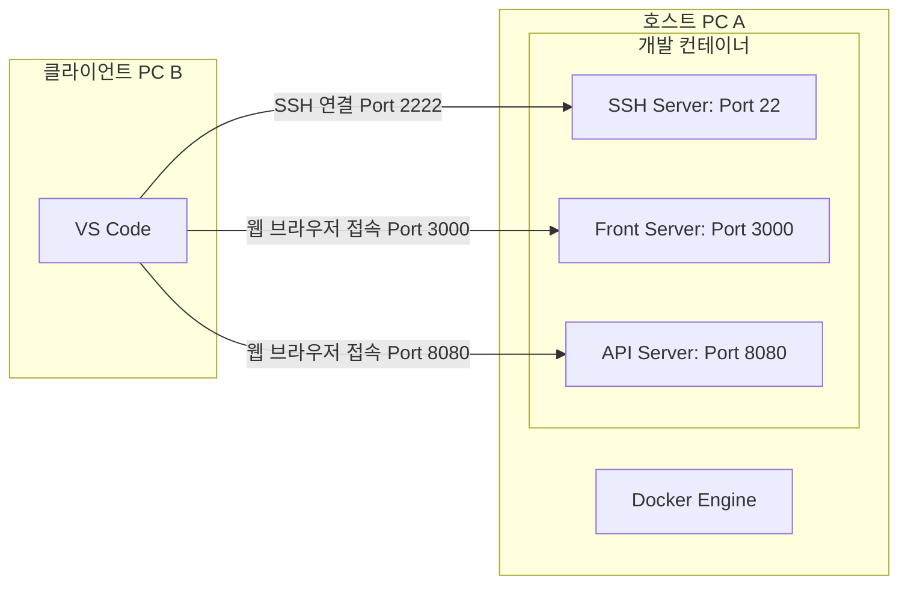
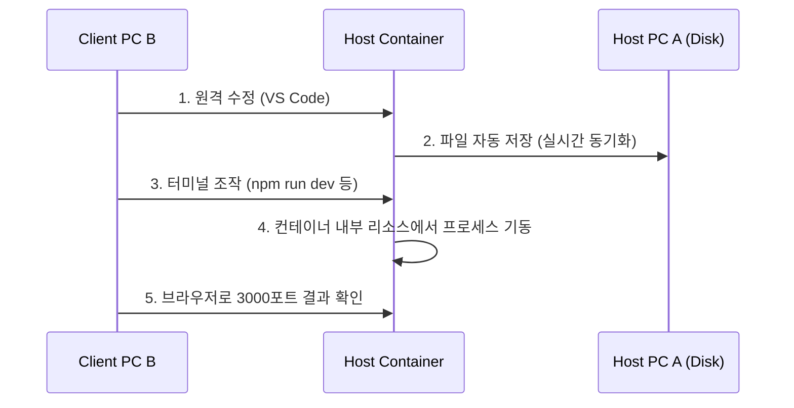
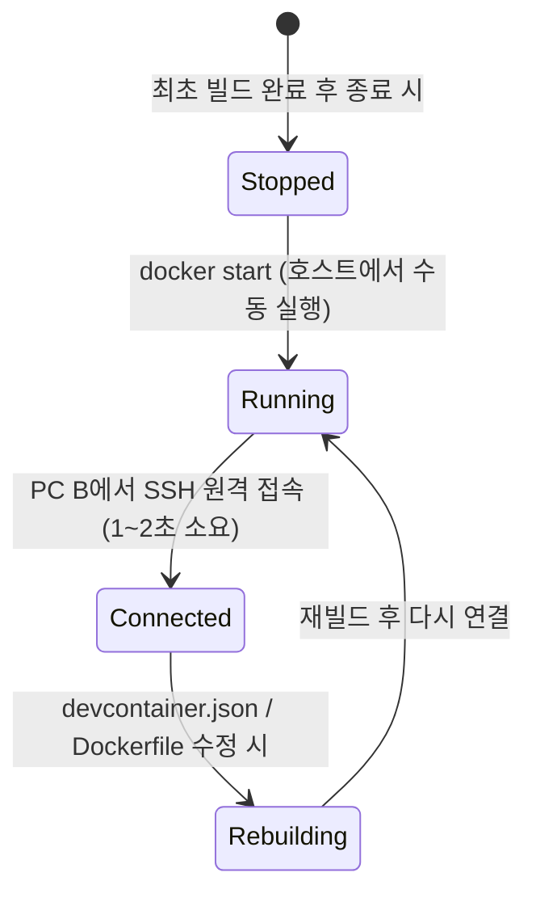

# VS Code + Dev Containers 개발 환경 구축 가이드

이 가이드는 VS Code와 Docker를 연동하여 컨테이너 내부에서 개발 환경을 격리하고 실행하는 방법을 설명하며, 로컬 네트워크(LAN) 내의 다른 PC에서 연결할 수 있는 설정 방법까지 포함합니다.

---

## 1. 사전 준비 사항

Dev Containers를 사용하기 위해 로컬 PC에 다음 프로그램들이 설치되어 있어야 합니다.

1. **Docker Desktop** (또는 OrbStack, Rancher Desktop 등) 설치 및 실행
2. **VS Code (Visual Studio Code)** 설치
3. VS Code 확장 프로그램 설치:
   * **Dev Containers** (공식 확장, ID: `ms-vscode-remote.remote-containers`)

---

## 2. 프로젝트 파일 구성 상세 (Dockerfile & devcontainer.json)

텅 빈 프로젝트 폴더에서 오류 없이 컨테이너를 구동하며, 동시에 외부 원격 접속을 위한 SSH 환경을 구비하는 구성입니다.

### 설정 구조
```text
my-project/
└── .devcontainer/
    ├── devcontainer.json  # Dev Container 설정 파일
    ├── Dockerfile         # 개발용 베이스 이미지 정의
    └── entrypoint.sh      # 컨테이너 시작 시 SSH 서비스 자동 실행 스크립트
```

### 1) `entrypoint.sh` 작성
컨테이너가 기동되는 즉시 SSH 서비스를 실행하고 지속시키는 진입점 셸 스크립트입니다.
> [!IMPORTANT]
> 스크립트를 생성한 뒤, 호스트 PC 터미널에서 **`chmod +x .devcontainer/entrypoint.sh`** 명령을 실행하여 반드시 실행 권한을 부여해 주어야 합니다.

```bash
#!/bin/bash
# 1. SSH 백그라운드 서비스 시작
echo "[System] Starting SSH server..."
sudo service ssh start

# 2. 컨테이너가 즉시 종료되는 것을 방지하기 위해 무한 대기 명령 실행
tail -f /dev/null
```

### 2) `Dockerfile` 작성
개발 베이스 이미지에 SSH 서버 및 시스템 유틸리티를 안전하게 설치하고, 위에서 작성한 `entrypoint.sh`를 컨테이너의 기본 실행 명령으로 지정합니다.

```dockerfile
# 1. 텅 빈 프로젝트를 위한 범용 베이스 이미지 선택 (Node.js 20 버전)
FROM mcr.microsoft.com/devcontainers/javascript-node:20

# 2. OpenSSH 서버 및 시스템 필수 도구 안전하게 설치
RUN apt-get update && apt-get install -y \
    curl \
    git \
    openssh-server \
    sudo \
    tar \
    dbus \
    binutils \
    && rm -rf /var/lib/apt/lists/*

# 3. SSH 서비스 기동을 위한 디렉토리 사전 확보 및 권한 설정
RUN mkdir -p /var/run/sshd && chmod 0755 /var/run/sshd

# 4. 로그인 암호 설정 (원격 PC SSH 로그인용)
RUN echo 'root:rootpassword' | chpasswd && \
    echo 'node:nodepassword' | chpasswd

# 5. SSH 로그인 정책 변경 (루트 접속 허용 및 패스워드 인증 활성화)
RUN sed -i 's/#PermitRootLogin prohibit-password/PermitRootLogin yes/' /etc/ssh/sshd_config && \
    sed -i 's/#PasswordAuthentication yes/PasswordAuthentication yes/' /etc/ssh/sshd_config

# 6. 진입점 자동 시작 스크립트(entrypoint.sh) 복사 및 실행권한 부여
COPY entrypoint.sh /usr/local/bin/entrypoint.sh
RUN chmod +x /usr/local/bin/entrypoint.sh

# 7. 개발용 포트 및 SSH 포트 개방
EXPOSE 22 3000 8080

# 8. 컨테이너 시작 시 실행될 진입점 스크립트 지정
ENTRYPOINT ["/usr/local/bin/entrypoint.sh"]
```

### 3) `devcontainer.json` 작성
VS Code Dev Container가 구동될 때 `Dockerfile`의 `ENTRYPOINT`가 무력화되지 않도록 `"overrideCommand": false`를 필수로 지정해 줍니다.

```json
{
  "name": "SSH 자동 실행형 개발 환경",
  
  // Dockerfile 위치 지정 및 빌드 옵션
  "build": {
    "dockerfile": "Dockerfile",
    "context": "."
  },

  // 중요: Dockerfile에 정의된 ENTRYPOINT(entrypoint.sh)가 무시되지 않고 
  // 컨테이너 시작 시 함께 실행되도록 overrideCommand를 false로 설정합니다.
  "overrideCommand": false,

  // 컨테이너 내부에서 실행할 VS Code 확장 프로그램 목록
  "customizations": {
    "vscode": {
      "settings": {
        // 컨테이너 내 VS Code 기본 터미널을 bash로 설정
        "terminal.integrated.defaultProfile.linux": "bash"
      },
      "extensions": [
        "christian-kohler.path-intellisense" // 경로 자동완성
      ]
    }
  },

  // 호스트와 컨테이너 포트를 지정하여 강제 바인딩 (다중 포트 매핑)
  "appPort": [
    "2222:22",       // SSH 원격 연결용 (호스트 2222 -> 컨테이너 22)
    "3000:3000",     // 1번 개발 서버 (호스트 3000 -> 컨테이너 3000)
    "8080:8080"      // 2번 개발 서버 (호스트 8080 -> 컨테이너 8080)
  ],

  // 로컬 컴퓨터로 포워딩할 포트 목록
  "forwardPorts": [22, 3000, 8080]
}
```

---

## 3. Environment Setup & Run Steps (환경 구축 및 실행 단계)

설정 파일을 모두 작성한 후, 실제로 개발 컨테이너를 구동하는 방법은 다음과 같습니다.

### 단계 1: 프로젝트 열기
1. VS Code를 실행합니다.
2. `파일(File) > 폴더 열기(Open Folder...)`를 눌러 `.devcontainer` 폴더가 들어있는 프로젝트 루트 디렉토리를 엽니다.

### 단계 2: 컨테이너 빌드 및 진입
1. VS Code 화면 우측 하단에 **"Reopen in Container"**(컨테이너에서 다시 열기) 팝업 알림이 뜨면 해당 버튼을 클릭합니다.
2. 팝업이 뜨지 않는다면:
   * 맥(macOS): `Cmd + Shift + P` 단축키를 눌러 명령 팔레트를 엽니다.
   * 윈도우/리눅스: `Ctrl + Shift + P` 또는 `F1` 키를 눌러 명령 팔레트를 엽니다.
   * 검색창에 **`Dev Containers: Reopen in Container`**를 입력하고 선택합니다.

---

## 4. 로컬 네트워크(LAN)의 다른 PC에서 연결하기

동일한 공유기(Wi-Fi 또는 유선 LAN)를 사용하는 다른 컴퓨터(클라이언트 PC B)의 VS Code에서, 서버 컴퓨터(호스트 PC A)의 개발 컨테이너 내부로 접속하여 코딩하는 방법입니다.



### 단계 1: 호스트 PC A의 IP 확인
1. **호스트 PC A의 사설 IP 주소 확인**:
   * macOS: 터미널에서 `ipconfig getifaddr en0` 또는 `ifconfig` 실행하여 `192.168.x.x` 형태의 IP 주소 기록 (예: `192.168.10.226`)
   * Windows: CMD에서 `ipconfig` 실행 후 `IPv4 주소` 기록

---

### 단계 2: 클라이언트 PC B에 원격 확장 기능 설치
접속을 시도할 클라이언트 PC B의 VS Code에서 아래 단계를 진행합니다.
1. VS Code를 켭니다.
2. 좌측 확장(Extensions) 탭(`Ctrl + Shift + X` / `Cmd + Shift + X`)을 누릅니다.
3. **`Remote - SSH`** (공식 확장, ID: `ms-vscode-remote.remote-ssh`)를 검색하여 설치합니다.

---

### 단계 3: SSH 연결 프로필 등록 및 연결

1. **명령 팔레트 열기**: PC B의 VS Code에서 `F1` (또는 `Ctrl + Shift + P`)을 누릅니다.
2. **SSH 호스트 구성**: `Remote-SSH: Open SSH Configuration File...`을 검색하고 선택한 후, 사용자 홈 경로 아래의 `config` 파일을 선택합니다.
3. **설정값 추가**: 아래 형식을 참고하여 호스트 PC A 충돌 방지용 포트(`2222`)를 포함해 입력합니다.
   ```text
   Host DevContainer-HostA
       HostName 192.168.10.226    # 호스트 PC A의 IP 주소 기입
       User root                 # Dockerfile에서 설정한 사용자 (예: root)
       Port 2222                 # devcontainer.json에 매핑된 호스트 포트번호
   ```
4. **연결 실행**: 다시 명령 팔레트(`F1`)를 열어 **`Remote-SSH: Connect to Host...`**를 선택합니다.
5. 리스트에서 방금 추가한 **`DevContainer-HostA`**를 클릭합니다.
6. 새로운 VS Code 창이 열리며, 타겟 운영체제 선택 팝업이 뜨면 `Linux`를 선택하고, 암호 입력창이 나타나면 `rootpassword`를 입력합니다.

---

### 단계 4: 컨테이너 내부 개발 디렉토리 (/workspaces) 열기
1. 연결이 정상 완료되면 PC B VS Code의 좌측 하단 상태 표시줄에 **`SSH: DevContainer-HostA`**가 표시됩니다.
2. 메뉴에서 `파일(File) > 폴더 열기(Open Folder...)`를 누릅니다.
3. 최초 열기 시 호스트 PC A의 홈 디렉토리(예: `/root`)가 기본 경로로 지정되어 있을 수 있습니다. 이 부분을 수정하여 **`/workspaces/프로젝트폴더명`** (예: `/workspaces/my-project`)을 입력하고 **확인**을 누릅니다.
4. 비밀번호를 한 번 더 입력하면 원격 서버 A의 컨테이너 내부 파일들을 로컬 파일처럼 실시간 수정 및 빌드할 수 있게 됩니다.

---

## 5. 접속이 안 될 때 자가진단 (Troubleshooting)

### 에러: `$PLATFORM is undefined in installation script output` & `Failed to parse remote port`
원격 연결 시 클라이언트 VS Code가 컨테이너 내부에 VS Code Server 바이너리를 다운로드하고 파싱하는 설치 과정에서 내부 도구 부재나 스크립트 출력 왜곡으로 오류가 발생하는 경우입니다.
* **해결 방법**:
  1. **Dockerfile 보강**: Dockerfile 내에 패키지 압축 및 아키텍처 조회에 필요한 `tar`와 `binutils`, `dbus` 유틸리티를 명시적으로 설치하는 구문을 포함하고 컨테이너를 재빌드(Rebuild)합니다.
  2. **기본 셸 통일**: `devcontainer.json` 설정 중 `terminal.integrated.defaultProfile.linux` 항목 값을 `bash`로 지정하여 부수적인 로그인 출력을 방지합니다.
  3. **서버 찌꺼기 삭제**: 터미널을 통해 `ssh root@<IP> -p 2222`로 수동 SSH 진입한 뒤, 홈 디렉토리 밑에 불완전하게 설치되어 충돌하는 `.vscode-server` 폴더를 `rm -rf ~/.vscode-server` 명령으로 제거하고 다시 접속을 시도합니다.

### 에러: `ssh: connect to host <IP> port 22: Connection refused`
호스트 PC 자체의 22번 포트(SSH)가 이미 선점되어 컨테이너의 22번 포트가 밖으로 열리지 못할 때 주로 발생합니다.
* **해결 방법**:
  1. `devcontainer.json`을 수정하여 포트를 `2222:22` 등으로 다르게 포워딩합니다. (상단의 2번 항목 참조)
  2. 접속 시 `ssh root@192.168.10.226 -p 2222`와 같이 변경한 포트를 지정하여 시도합니다.
  3. 호스트 PC A의 터미널에서 `docker ps`를 입력하여 포트가 잘 열려있는지 확인합니다.
     * 올바른 출력 예: `0.0.0.0:2222->22/tcp`

### 에러: `Connection Timeout` (시간 초과) 발생 시
* **해결 방법**: 호스트 PC A의 운영체제 방화벽이 외부 접속 포트(예: 2222)를 차단하고 있는지 점검하고, 인바운드 방화벽 규칙을 허용해 주어야 합니다.

### 에러: `Host Key Verification Failed` (보안 경고) 발생 시
* **해결 방법**: 컨테이너가 다시 빌드될 때마다 SSH 고유 인증키가 바뀌어 PC B에서 보안 오류를 낼 수 있습니다. 
  * PC B의 터미널에서 `ssh-keygen -R 192.168.10.226` (또는 지정된 포트가 있는 경우 `ssh-keygen -R [192.168.10.226]:2222`) 명령을 실행해 기존 등록된 호스트 키 정보를 지운 후 다시 연결을 재시도합니다.

---

## 6. 컨테이너 환경의 작동 원리 및 작업 저장 공간

### 1) 작성한 코드는 어디에 저장되나요?
* **결론: 호스트 PC A(내 물리 컴퓨터) 하드디스크에 실시간으로 직접 저장됩니다.**
* **작동 원리 (볼륨 마운트)**:
  VS Code Dev Containers가 구동될 때, 호스트 PC A의 프로젝트 루트 폴더를 컨테이너 내부의 `/workspaces/프로젝트명` 디렉토리로 자동으로 **동기화 마운트(Mount)**시킵니다.
  따라서 클라이언트 PC B에서 원격 접속하여 컨테이너 안의 파일을 수정하고 저장(`Ctrl + S`)하더라도, 그 변경사항은 즉시 호스트 PC A의 원래 하드디스크 폴더에 기록됩니다.
* **이점**: 컨테이너가 중단되거나 삭제, 혹은 설정 변경으로 인해 재생성(Rebuild)되더라도 **여러분이 작성한 소스 코드는 절대 사라지지 않고 안전하게 로컬 디스크에 보존**됩니다.

### 2) 개발 작업은 구체적으로 어떻게 진행하나요?
컨테이너 환경 연결이 완비된 후의 개발 사이클은 다음과 같습니다.



1. **파일 편집 및 관리**:
   * 로컬 프로젝트 환경과 동일하게 VS Code 사이드바에서 새 파일을 만들고 코드를 편집하면 됩니다.
2. **패키지 설치 및 실행 (터미널 사용)**:
   * VS Code 내부 터미널(`Ctrl + ~`)을 활성화합니다. 이 터미널은 컨테이너 OS 환경에 바로 맞물려 있습니다.
   * `npm install`, `pip install` 등 개발에 필요한 패키지 설치 명령어는 모두 **이 컨테이너 내부 터미널에서 실행**합니다.
   * 이로 인해 호스트 PC A에는 해당 개발 언어(Node.js, Python 등)나 패키지가 설치되지 않아 PC를 깨끗하게 유지할 수 있습니다.
3. **코드 버전 관리 (Git)**:
   * 컨테이너 안의 VS Code가 소스 제어를 자동으로 인지합니다. 평소와 같이 `git add`, `git commit` 등의 Git 작업을 컨테이너 터미널 혹은 VS Code Git GUI 탭을 통해 수행하시면 됩니다.

---

## 7. 여러 개발 서버를 동시에 열어두고 사용하는 방법

개발 중 프론트엔드(예: 3000 포트)와 백엔드 API 서버(예: 8080 포트)를 동시에 구동하고 외부에서 각각 접속해야 할 때 다음과 같이 구성합니다.

### 1) 설정 파일 구성 (`devcontainer.json` & `Dockerfile`)
가장 먼저 `devcontainer.json`에 사용할 다중 포트가 정의되어 있어야 합니다.
* 본 가이드 2번 섹션의 템플릿처럼 `appPort` 리스트에 `3000:3000`, `8080:8080`과 같이 필요한 여러 개의 포트를 맵핑해 두고 컨테이너를 구동합니다.
* `Dockerfile` 에도 사용할 포트들(`EXPOSE 3000 8080`)을 개방해 줍니다.

### 2) 개별 독립 터미널 실행
VS Code 터미널은 멀티 터미널을 완벽하게 지원합니다.
1. VS Code 하단 터미널 우측 상단의 `+` 아이콘(New Terminal)을 눌러 터미널을 여러 개 생성합니다.
2. **1번 터미널**: 프론트엔드 디렉토리로 이동 후 서버 가동
   ```bash
   # 예시: 3000 포트로 실행되는 웹 개발 서버 가동
   npm run dev
   ```
3. **2번 터미널**: 백엔드 디렉토리로 이동 후 서버 가동
   ```bash
   # 예시: 8080 포트로 실행되는 API 서버 가동
   python manage.py runserver 0.0.0.0:8080
   ```

### 3) 0.0.0.0 바인딩 규칙 준수 (매우 중요)
* 컨테이너 내부에서 서버를 띄울 때 호스트 주소를 `localhost`나 `127.0.0.1`로 띄우면 컨테이너 루프백 망에만 묶이게 되어 외부 PC B가 접근할 수 없습니다.
* 웹팩, 리액트, 스프링 부트 등의 서버를 시작할 때 호스트 수신 대기 주소를 반드시 **`0.0.0.0`** 또는 모든 인터페이스 바인딩 옵션(예: `--host 0.0.0.0`)으로 설정하여 실행해야 합니다.

### 4) 다른 PC B에서 각 서버로 접속
외부 PC B의 웹 브라우저에서 각각의 포트로 접속합니다.
* **프론트엔드**: `http://192.168.10.226:3000`
* **백엔드 API**: `http://192.168.10.226:8080`

---

## 8. 다중 프로젝트(Multi-Project) 동시 운용 방법

호스트 PC A에서 여러 프로젝트(예: `A-project`, `B-project`)를 위한 독립적인 개발 환경 컨테이너들을 동시에 구동하여 병렬로 개발하는 방법입니다.

### 1) 작동 원리 (컨테이너 간의 독립적 포트 포워딩 구조)
각 컨테이너 내부의 가상 포트(예: SSH 기본 22번, 웹 기본 3000번)는 서로 가상으로 완벽히 격리되어 있어 번호가 겹쳐도 상관없습니다. 그러나 이 가상 포트들을 **호스트 PC A의 실제 물리 포트**에 매핑할 때는 포트 충돌을 피하기 위해 반드시 서로 다른 유일한 포트로 배정해야 합니다.

```text
[호스트 PC A (실제 컴퓨터)]
  ├── 포트 2222  ───────>  [컨테이너 A (A-project)]  ───> 내부 포트 22 (SSH)
  ├── 포트 3000  ───────>  [컨테이너 A (A-project)]  ───> 내부 포트 3000 (웹)
  │
  ├── 포트 2223  ───────>  [컨테이너 B (B-project)]  ───> 내부 포트 22 (SSH)
  └── 포트 3001  ───────>  [컨테이너 B (B-project)]  ───> 내부 포트 3000 (웹)
```

---

### 2) 설정 파일 구성 예시

#### [프로젝트 A 설정 예시]
* **`A-project/.devcontainer/devcontainer.json`**:
  ```json
  {
    "name": "A-Project-Dev",
    "build": {
      "dockerfile": "Dockerfile",
      "context": "."
    },
    "overrideCommand": false,
    "appPort": [
      "2222:22",     // 호스트의 2222번 포트 -> 컨테이너 A의 22번 포트 (SSH)
      "3000:3000"    // 호스트의 3000번 포트 -> 컨테이너 A의 3000번 포트 (웹서버)
    ],
    "forwardPorts": [22, 3000]
  }
  ```

#### [프로젝트 B 설정 예시]
* **`B-project/.devcontainer/devcontainer.json`**:
  ```json
  {
    "name": "B-Project-Dev",
    "build": {
      "dockerfile": "Dockerfile",
      "context": "."
    },
    "overrideCommand": false,
    "appPort": [
      "2223:22",     // 호스트의 2223번 포트 -> 컨테이너 B의 22번 포트 (SSH 충돌 회피)
      "3001:3000"    // 호스트의 3001번 포트 -> 컨테이너 B의 3000번 포트 (웹서버 충돌 회피)
    ],
    "forwardPorts": [22, 3000]
  }
  ```

---

### 3) 외부 클라이언트 PC B에서 각각 연결하기
PC B의 SSH `config` 파일에 각 프로젝트를 구별하여 프로필을 설정하고 접속합니다.

* **PC B의 SSH `config` 설정**:
  ```text
  # A-project 접속 프로필
  Host A-Project
      HostName 192.168.10.226
      User root
      Port 2222            # A-project 매핑 호스트 포

  # B-project 접속 프로필
  Host B-Project
      HostName 192.168.10.226
      User root
      Port 2223            # B-project 매핑 호스트 포트 (우회 포트)
  ```
* **브라우저 확인**:
  * A-project 페이지: `http://192.168.10.226:3000`
  * B-project 페이지: `http://192.168.10.226:3001`

---

## 9. 컨테이너 생명 주기(Lifecycle) 및 유지 관리 요령

한 번 빌드된 컨테이너는 매번 재빌드할 필요가 없습니다. 하지만 VS Code 원격 확장의 특성을 고려해 다음 내용을 알아두면 유지 관리가 매우 편리해집니다.



### 1) 왜 자꾸 새로 빌드하려고 하나요?
* **설정 감지**: VS Code는 `.devcontainer/` 내부 파일의 수정을 감지하면 컨테이너 설정을 동기화하기 위해 자동 Rebuild 팝업을 띄웁니다. 이때 허용하면 컨테이너가 파기되고 새로 빌드됩니다.
* **자동 중지**: VS Code 창을 닫아 세션을 정상 종료하면 호스트 PC의 컴퓨팅 리소스 보존을 위해 실행 중이던 컨테이너가 자동으로 중지(`Stop`) 상태로 바뀝니다.

### 2) 빌드 없이 기존 컨테이너에 즉시 연결하여 구동하는 방법
매번 빌드하는 대기 시간 없이, 기동되어 있는 기존 컨테이너에 초고속으로 연결하는 모범 순서입니다.

1. **호스트 PC A에서 컨테이너 수동 가동**:
   * 호스트 PC A의 터미널이나 Docker Desktop 대시보드에서 꺼져 있는 기존 컨테이너를 켭니다.
   ```bash
   # 중지된 컨테이너 목록 중 이름 확인 후 시작
   docker ps -a
   docker start <컨테이너_이름_또는_ID>
   ```
2. **클라이언트 PC B에서 SSH 연결 (매번 Reopen in Container 불필요)**:
   * 클라이언트 PC B에서 매번 `Reopen in Container` 명령을 실행할 필요가 **전혀 없습니다.**
   * PC B의 VS Code에서 앞서 등록한 프로필(`Remote-SSH: Connect to Host... > DevContainer-HostA`)을 선택해 접속합니다.
   * 이미 SSH 데몬이 켜져 있으므로 **약 1초 만에 즉시 VS Code 원격 윈도우가 열리며** 기존 작업 상태(마지막에 열려 있던 `/workspaces/프로젝트명` 디렉토리)가 자동으로 복원되어 바로 개발을 시작할 수 있습니다.
   * VS Code는 최근 열어두었던 원격 연결 정보를 기억하므로, VS Code를 재실행하기만 해도 자동으로 마지막 원격 컨테이너 내부로 접속을 완료합니다.

---

## 10. 고정된 컨테이너 이름(Container Name) 설정 방법

기본적으로 VS Code Dev Containers는 프로젝트의 경로 해시값과 임의 수식어를 섞어 다소 복잡한 무작위 조합의 컨테이너 이름(예: `devcontainer_AProject_12a34b...`)을 만듭니다. 
이 이름을 고정하여 관리하고 싶다면 `devcontainer.json` 파일의 **`runArgs`** 설정을 활용합니다.

### 1) 설정 방법
`.devcontainer/devcontainer.json` 파일에서 `runArgs` 배열에 `--name` 플래그와 고유한 이름을 아래와 같이 지정합니다.

```json
{
  "name": "고정 컨테이너 프로젝트",
  "build": {
    "dockerfile": "Dockerfile",
    "context": "."
  },
  
  // Docker 컨테이너 생성 옵션 지정 (컨테이너 이름 강제 부여)
  "runArgs": [
    "--network=bridge",
    "--name", "my-fixed-dev-container"  // 원하는 고유 이름 지정
  ],
  
  "overrideCommand": false,
  "appPort": [
    "2222:22"
  ],
  "forwardPorts": [22]
}
```

### 2) 효과
위와 같이 설정한 후 컨테이너를 Rebuild 해 주면, Docker 엔진 상에서 컨테이너의 별칭이 항상 **`my-fixed-dev-container`**로 생성됩니다. 
이후 호스트 PC A에서 컨테이너를 수동으로 켤 때 임의의 해시값을 찾을 필요 없이 아래의 단일 명령어로 손쉽게 시작할 수 있게 됩니다.
```bash
docker start my-fixed-dev-container
```
