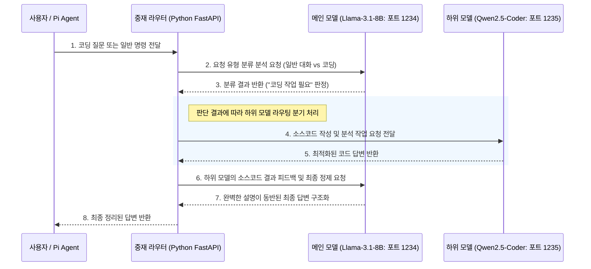

<!-- version: v1.0.0 -->
# 💻 Pi Coding Agent 연동을 위한 로컬 AI 백엔드 구축 가이드 (LM Studio 전용)

이 가이드는 **Pi Coding Agent (`pi`)**에 연결하여 사용할 수 있는 오프라인 로컬 AI 백엔드 서버를 **LM Studio** 기준으로 구축하는 방법을 정리한 문서입니다.

사용자가 모델을 직접 로컬 PC에 다운로드하고 구동하여 API 형태로 외부 에이전트와 연동할 수 있도록 OS 환경 및 플랫폼별 단계별 설치/설정 방법을 안내합니다.

---

## 📌 목차 바로가기
* [1. LM Studio 선정 및 모델 안내](#-1-lm-studio-선정-및-모델-안내)
  * [🧠 추천 AI 모델 (코딩 전용)](#-추천-ai-모델-코딩-전용)
  * [⚙️ PC 성능별 모델 및 추론(Inference) 설정 예시](#️-pc-성능별-모델-및-추론inference-설정-예시)
* [2. macOS 환경 구축 가이드](#-2-macos-환경-구축-가이드)
  * [Apple Silicon Mac](#2-1-apple-silicon-mac-m1-m2-m3-m4-등)
  * [Intel Mac](#2-2-intel-mac-이전-세대-imac-macbook-pro-등)
* [3. Linux 환경 구축 가이드](#-3-linux-환경-구축-가이드)
* [4. Windows 환경 구축 가이드](#-4-windows-환경-구축-가이드)
* [5. LM Studio 환경 설정 및 Pi Coding Agent 연동 방법](#-5-lm-studio-환경-설정-및-pi-coding-agent-연동-방법)
  * [Pi Coding Agent 설치 방법](#-5-0-pi-coding-agent-pi-설치-방법)
  * [LM Studio 환경 설정](#-5-1-lm-studio-환경-설정)
  * [Pi Coding Agent 자동 인식 설정](#-5-2-pi-coding-agent-pi-자동-인식-설정-추천-)
  * [models.json 정의 명세](#-5-3-modelsjson을-통한-명시적-모델-메타데이터-수동-정의-방법)
  * [수동 환경 변수 오버라이드 기동](#-5-4-수동-환경-변수-오버라이드-기동)
* [6. 원격 서버 연동 가이드](#-6-원격-서버-연동-가이드-다른-pc에서-실행-및-pi-연결)
  * [호스트 PC 설정](#6-1-호스트-pc-설정-lm-studio-구동-pc)
  * [클라이언트 PC 설정](#6-2-클라이언트-pc-설정-pi-에이전트-구동-pc)
  * [다중 접속 및 동시성 주의사항](#6-3-️-다중-접속-및-동시성concurrency-주의사항)
* [7. 로컬 다중 모델 오케스트레이션 구성 가이드 (AGY 스타일)](#-7-로컬-다중-모델-오케스트레이션-구성-가이드-agy-스타일)
  * [LM Studio 다중 서버 실행 (포트 분할)](#7-1-방법-a-lm-studio-다중-서버-실행-포트-분할)
  * [LiteLLM 프록시 라우터 구성](#7-2-방법-b-litellm-프록시-라우터-구성)
  * [에이전트(models.json) 다중 모델 바인딩 예시](#7-3-에이전트modelsjson-다중-모델-바인딩-예시)
* [8. 메인 모델 자율 오케스트레이터 구현 가이드 (Agentic Orchestrator)](#-8-메인-모델-자율-오케스트레이터-구현-가이드-agentic-orchestrator)
  * [동작 메커니즘 아키텍처](#8-1-동작-메커니즘-아키텍처)
  * [1단계: 필수 추가 프로그램 및 라이브러리 설치](#8-2-️-1단계-필수-추가-프로그램-및-라이브러리-설치)
  * [2단계: LM Studio 다중 모델 서버 구동 (포트 분할)](#8-3--2단계-lm-studio-다중-모델-서버-구동-포트-분할)
  * [3단계: OpenAI 규격 호환 중재 프록시 코드 작성 (`orchestrator.py`)](#8-4-️-3단계-openai-규격-호환-중재-프록시-코드-작성-orchestratorpy)
  * [4단계: Pi Coding Agent (`pi`) 연동 환경 설정](#8-5-️-4단계-pi-coding-agent-pi-연동-환경-설정)
  * [5단계: 시스템 실행 및 확인 방법](#8-6--5단계-시스템-실행-및-확인-방법)

---

## 🔍 1. LM Studio 선정 및 모델 안내

**LM Studio**는 GUI가 매우 강력하고 모델 탐색, 다운로드, 추론 테스트가 시각적으로 직관적인 로컬 AI 실행 도구입니다.

### 🧠 추천 AI 모델 (코딩 전용)
Pi Coding Agent와 연동하여 안정적인 소스코드 분석 및 수정을 수행하려면 **도구 호출(Tool Calling/Function Calling)** 성능이 우수한 아래 모델을 추천합니다.
*   **Qwen2.5-Coder-7B-Instruct** (또는 저사양 구성을 위한 **Qwen2.5-Coder-3B-Instruct**)
*   **Llama-3.1-8B-Instruct** (범용 코딩 및 추론에 우수)

> ⚠️ **도구 호출(Tool Call) 실패 이슈 주의**:
> `pi` 에이전트 실행 시 파일 쓰기/수정 도구를 작동시키지 못하고 `{"name": "write", ...}` 형태의 Raw JSON 텍스트만 출력되는 오작동이 일어난다면, 모델이 도구 사용 지시를 이해하지 못하고 있는 상태입니다. 
> 반드시 모델 태그명에 **`-instruct`**가 명시된 전용 지시어 튜닝 모델을 설치해 사용해야 합니다.

### ⚙️ PC 성능별 모델 및 추론(Inference) 설정 예시

PC 사양에 맞춰 원활한 동작 속도를 확보하기 위한 LM Studio 우측 설정(Inference Parameters) 권장 가이드라인입니다.

| 구분 | 저사양 환경 (VRAM 4GB 이하 / 내장그래픽) | 중사양 환경 (VRAM 6GB ~ 8GB / M1·M2 8G~16G) | 고사양 환경 (VRAM 12GB 이상 / Mac 24G 이상) |
| :--- | :--- | :--- | :--- |
| **추천 모델** | `Qwen2.5-Coder-3B-Instruct-GGUF` | `Qwen2.5-Coder-7B-Instruct-GGUF` | `Qwen2.5-Coder-14B-Instruct-GGUF` |
| **양자화 레벨** | `Q4_K_M` (4비트 중간 압축) | `Q4_K_M` 또는 `Q5_K_M` | `Q8_0` (8비트) 또는 원본 가중치 (`FP16`) |
| **GPU Offload** | `0` ~ `10` (최소한의 오프로드로 VRAM 부족 방지) | `20` ~ `28` (대부분의 연산을 GPU로 할당) | `Max` (모든 레이어를 GPU VRAM에 업로드) |
| **Context Window** | `4096` (컨텍스트 창 크기 제안으로 OOM 에러 방지) | `8192` ~ `16384` | `16384` ~ `32768` (대용량 소스 파일 탐색 가능) |
| **Temperature** | `0.1` (결과물의 변동성을 줄여 코딩 정합성 향상) | `0.2` | `0.0` ~ `0.2` (추론 일관성 확보) |

---

## 🍎 2. macOS 환경 구축 가이드

macOS는 CPU 아키텍처에 따라 지원 라이브러리 및 하드웨어 가속 방식이 다르므로, 본인의 시스템 사양에 맞는 옵션을 선택해야 합니다.

### 2-1. Apple Silicon Mac (M1, M2, M3, M4 등)
M 시리즈 칩은 통합 메모리(Unified Memory)를 통해 GPU 가속을 완벽히 지원하므로 대규모 모델도 매우 빠르게 작동합니다.

1. **LM Studio 다운로드 및 설치**:
   * [LM Studio 공식 홈페이지](https://lmstudio.ai)에서 Apple Silicon (M1/M2/M3/M4) 전용 `.dmg` 파일을 받아 설치합니다.
2. **모델 검색 및 다운로드**:
   * 앱 실행 후 왼쪽 돋보기(검색) 탭에서 `Qwen2.5-Coder-3B-Instruct`를 검색한 뒤 양자화 모델(예: Q4_K_M 등)을 다운로드합니다.
3. **로컬 서버 기동**:
   * 왼쪽 사이드바의 양방향 화살표 모양(Local Server) 탭으로 이동합니다.
   * 다운로드한 Qwen 모델을 상단에서 선택하여 로드합니다.
   * **Start Server** 버튼을 눌러 로컬 API 서버를 시작합니다 (기본 포트: `1234`).

### 2-2. Intel Mac (이전 세대 iMac, MacBook Pro 등)
1. **지원 유무**:
   * LM Studio는 현재 **Intel macOS를 공식 지원하지 않습니다**. 앱 구조가 Apple Silicon 아키텍처의 하드웨어 가속(Metal 및 MLX)에 맞춰 최적화되어 있습니다.
2. **우회책**:
   * Intel Mac에서 LM Studio를 사용하려면 Boot Camp를 사용해 Windows를 구동한 후 Vulkan 드라이버를 적용해 실행하는 것이 유일한 우회 방법이지만 성능이 매우 떨어져 실사용이 어렵습니다.
   * 따라서 Intel Mac 환경에서는 LM Studio 구동을 권장하지 않습니다.

---

## 🐧 3. Linux 환경 구축 가이드

Linux 환경은 GUI가 탑재된 데스크톱 환경과 터미널 위주의 헤드리스(Headless) 서버 환경으로 나뉩니다. 상황에 맞게 다음 중 하나의 방법으로 설치하고 기동하십시오.

### 3-1. GUI 환경 (데스크톱)
1. **AppImage 다운로드**:
   * LM Studio 공식 사이트에서 Linux용 `.AppImage` 파일을 다운로드합니다.
2. **실행 권한 부여 및 기동**:
   ```bash
   chmod +x LM_Studio-*.AppImage
   ./LM_Studio-*.AppImage
   ```
   * 만약 샌드박스 오류로 실행이 실패하는 경우 `--no-sandbox` 옵션을 붙여 줍니다.
     ```bash
     ./LM_Studio-*.AppImage --no-sandbox
     ```

### 3-2. 헤드리스 환경 (GUI 미지원 서버 - AppImage 압축 해제 우회)
서버나 가상환경 등 물리 디스플레이(Display)가 없거나 샌드박스 보안 문제로 AppImage 실행에 제약이 있는 경우, AppImage 내부의 압축을 명시적으로 해제(`--appimage-extract`)하여 구동하는 방식을 권장합니다.

1. **AppImage 압축 해제**:
   ```bash
   chmod +x LM_Studio-*.AppImage
   ./LM_Studio-*.AppImage --appimage-extract
   ```
   *실행 시 현재 디렉터리에 `squashfs-root` 폴더가 생성됩니다.*

2. **샌드박스 소유권 및 권한 설정**:
   추출한 Electron 샌드박스 도구의 보안 설정이 올바르지 않으면 실행 에러가 발생하므로 아래와 같이 설정을 변경합니다.
   ```bash
   cd squashfs-root
   sudo chown root:root chrome-sandbox
   sudo chmod 4755 chrome-sandbox
   ```

3. **가상 디스플레이(xvfb)와 함께 서비스 실행**:
   ```bash
   # 가상 프레임 버퍼가 필요한 경우 xvfb 설치
   sudo apt-get update && sudo apt-get install -y xvfb
   
   # 샌드박스를 사용하여 백그라운드 구동
   xvfb-run --auto-servernum ./lm-studio &
   ```

### 3-3. 헤드리스 전용 백그라운드 데몬 (`llmster` / CLI)
LM Studio 공식 GUI가 전혀 필요 없고 백그라운드 데몬 및 CLI 형태로만 구동하고자 할 때는 공식 헤드리스 버전인 **llmster** 패키지를 설치합니다.
1. **원클릭 헤드리스 인스톨러 실행**:
   ```bash
   curl -fsSL https://lmstudio.ai/install.sh | bash
   ```
2. **CLI 연동 및 부트스트랩**:
   * 설치가 완료된 후, CLI 도구 `lms`를 사용하기 위해 환경에 바인딩합니다.
   ```bash
   ~/.lmstudio/bin/lms bootstrap
   ```
   *(새로운 터미널 세션을 열거나 `source ~/.bashrc` 등으로 PATH를 동기화해야 `lms` 명령어를 전역으로 사용 가능합니다.)*
3. **CLI 명령어를 활용한 서버 기동**:
   ```bash
   # Qwen 코딩 모델 다운로드
   lms get qwen2.5-coder-7b-instruct
   
   # 다운로드한 모델 로드 및 로컬 API 서버 시작
   lms server start
   ```

---

## 🪟 4. Windows 환경 구축 가이드

Windows 환경은 LM Studio 기본 앱을 활용하여 손쉽게 로컬 AI 서버를 구성할 수 있습니다.

1. **설치**:
   * LM Studio Windows 전용 인스톨러(.exe)를 내려받아 설치를 진행합니다.
2. **실행 및 서버 켜기**:
   * GUI 앱 내에서 모델을 설치한 뒤 Local Server에서 서버를 기동합니다. (Nvidia GPU 탑재 시 CUDA 연산으로 자동 전환됩니다.)

---

## 🔌 5. LM Studio 환경 설정 및 Pi Coding Agent 연동 방법

LM Studio 로컬 AI 백엔드 엔진을 구동할 때와 이를 Pi Coding Agent에 연결할 때는 **환경 변수(Environment Variable)** 및 **설정 파일**이 핵심적인 역할을 합니다.

---

### 5-0. Pi Coding Agent (`pi`) 설치 방법

Pi Coding Agent를 연동하기에 앞서, 아래 명령어를 실행하여 로컬 시스템에 에이전트를 설치해야 합니다.

#### 🪟 Windows (PowerShell) 환경
PowerShell에서 아래 스크립트를 실행하여 편리하게 자동 설치를 진행할 수 있습니다.
```powershell
# Windows용 설치 스크립트 실행
powershell -c "irm https://pi.dev/install.ps1 | iex"
```

#### 🍎🐧 macOS / Linux 환경 (npm 활용)
Node.js가 설치된 환경에서 `npm` 패키지 관리자를 사용해 설치를 진행합니다.
```bash
# 글로벌 npm 패키지로 설치 (스크립트 실행 무시 플래그 적용)
npm install -g --ignore-scripts @earendil-works/pi-coding-agent
```

---

### 5-1. LM Studio 환경 설정
* LM Studio GUI의 Local Server 설정에서 포트와 GPU 오프로드를 조율합니다. (기본 포트: `1234`)
* 외부 기기나 다른 컨테이너에서 접속 가능하도록 하려면 `Network Server Settings`에서 바인딩 주소를 `0.0.0.0`으로 개방합니다.

---

### 5-2. Pi Coding Agent (`pi`) 자동 인식 설정 (추천 ⭐)

`pi` 에이전트가 로컬에서 동작 중인 LM Studio 백엔드를 자동으로 탐지하고 정상 통신하도록 설정 파일들을 변경합니다.

#### 1️⃣ `config.json` 설정 파일 갱신
`~/.pi/agent/settings.json` (혹은 프로젝트 폴더 내 `.pi/settings.json`) 파일을 열어 `defaultProvider`와 `defaultModel`을 LM Studio 사양에 맞게 다음과 같이 수정합니다.

```json
{
  "lastChangelogVersion": "0.80.2",
  "theme": "light",
  "defaultProvider": "lm-studio=http://127.0.0.1:1234",
  "defaultModel": "qwen2.5-coder-7b-instruct",
  "packages": [
    "npm:pi-tools"
  ]
}
```
*   `defaultProvider`: `lm-studio=http://127.0.0.1:1234` 주소 규격으로 설정하여 LM Studio 포트로 통신하도록 유도합니다.

---

### 5-3. `models.json`을 통한 명시적 모델 메타데이터 수동 정의 방법

LM Studio가 불러오는 기본 목록 대신, 사용자가 특정 로컬 모델의 세부 사양(이름, 역할, 호출 토큰 한계 등)을 강제로 Pi 에이전트에 선언하고 사용하고 싶을 경우 **`models.json`** 파일을 직접 만들어서 바인딩할 수 있습니다.

#### 📁 `models.json` 작성 경로
* **전역 설정 경로**: `~/.pi/agent/models.json`
* **프로젝트 설정 경로**: 현재 작업 디렉터리의 `.pi/models.json`

#### 📄 `models.json` 모델 정의 명세 구조

```json
{
  "providers": {
    "local-lmstudio": {
      "baseUrl": "http://127.0.0.1:1234/v1",
      "api": "openai-completions",
      "apiKey": "lm-studio",
      "models": [
        {
          "id": "qwen2.5-coder-7b-instruct",
          "name": "LM Studio Qwen Coder 7B",
          "contextWindow": 16384,
          "maxTokens": 4096,
          "input": ["text"],
          "supportsToolCalling": true
        },
        {
          "id": "llama-3.1-8b-instruct",
          "name": "LM Studio Llama 3.1 8B",
          "contextWindow": 16384,
          "maxTokens": 4096,
          "input": ["text"],
          "supportsToolCalling": true
        }
      ]
    }
  }
}
```
*   `supportsToolCalling`: 각각의 모델이 에이전트 내 파일 쓰기/실행 도구(Tool Call)를 개별적으로 수행할 수 있도록 모델마다 명시해 주는 것이 안전합니다.

---

### 5-4. 수동 환경 변수 오버라이드 기동

패키지 설정 변경 없이 임시로 주입하여 실행하려면 다음 환경 변수를 세션에 등록 후 기동합니다.

```bash
export OPENAI_BASE_URL=http://localhost:1234/v1
export OPENAI_API_KEY=lm-studio
pi --model qwen2.5-coder-7b-instruct
```

---

## 🌐 6. 원격 서버 연동 가이드 (다른 PC에서 실행 및 pi 연결)

LM Studio를 특정 PC(호스트 서버)에 구동시켜 두고, 네트워크상의 다른 PC(클라이언트)에서 `pi` Coding Agent를 실행하여 원격으로 로컬 AI 자원을 공유하여 사용할 수 있습니다.

### 6-1. 호스트 PC 설정 (LM Studio 구동 PC)
1. **바인딩 주소 개방**:
   * LM Studio GUI의 **Local Server** 탭으로 이동합니다.
   * 우측의 **Network Server Settings** 설정으로 스크롤합니다.
   * 기본 바인딩 주소(`127.0.0.1`)를 **`0.0.0.0`**으로 변경하여 모든 네트워크 인터페이스로부터의 접근을 허용합니다.
2. **포트 번호 확인**:
   * 기본 설정된 포트 번호(예: `1234`)를 기억해 둡니다.
3. **방화벽 허용 규칙 추가 (인바운드 규칙)**:
   * **Windows**: `고급 보안이 설정된 Windows 방화벽`에서 포트(TCP `1234`) 인바운드 허용 규칙을 추가합니다.
   * **macOS**: `시스템 설정 > 네트워크 > 방화벽` 설정에서 LM Studio 앱의 외부 연결 수신을 허용합니다.
   * **Linux**: ufw를 사용하는 경우 포트를 개방합니다.
     ```bash
     sudo ufw allow 1234/tcp
     ```
4. **호스트 IP 확인**:
   * 명령프롬프트(CMD) 또는 터미널에서 호스트 PC의 로컬 IP(예: `192.168.0.100`)를 확인합니다.
     ```bash
     # macOS/Linux
     ifconfig | grep inet
     # Windows (CMD)
     ipconfig
     ```

### 6-2. 클라이언트 PC 설정 (pi 에이전트 구동 PC)
호스트 PC의 IP 주소와 포트(예: `http://192.168.0.100:1234`)를 타깃 엔드포인트로 설정하여 접속합니다.

#### Option A: 임시 환경 변수로 기동 (수동 실행)
```bash
export OPENAI_BASE_URL=http://192.168.0.100:1234/v1
export OPENAI_API_KEY=lm-studio
pi --model qwen2.5-coder-7b-instruct
```

#### Option B: `settings.json` 고정 등록
클라이언트 PC의 `~/.pi/agent/settings.json` 설정에 호스트의 원격 주소를 기입합니다.
```json
{
  "defaultProvider": "lm-studio=http://192.168.0.100:1234",
  "defaultModel": "qwen2.5-coder-7b-instruct",
  "packages": [
    "npm:pi-tools"
  ]
}
```

#### Option C: `models.json`을 통한 명시적 바인딩
클라이언트 PC의 현재 프로젝트 폴더 내 `.pi/models.json`을 새로 만들거나 편집하여 `baseUrl`을 호스트 주소로 매핑합니다.
```json
{
  "providers": {
    "remote-lmstudio": {
      "baseUrl": "http://192.168.0.100:1234/v1",
      "api": "openai-completions",
      "apiKey": "lm-studio",
      "models": [
        {
          "id": "qwen2.5-coder-7b-instruct",
          "name": "Remote LM Studio Qwen 7B",
          "contextWindow": 16384,
          "maxTokens": 4096,
          "input": ["text"],
          "supportsToolCalling": true
        }
      ]
    }
  }
}

---

### 6-3. ⚠️ 다중 접속 및 동시성(Concurrency) 주의사항

원격 네트워크를 개방하여 여러 사용자가 동시에 하나의 LM Studio 백엔드 인스턴스에 접속할 때 아래와 같은 동작 방식과 제약 사항이 있습니다.

1. **동시 호출 시의 대기열(Queueing) 작동**:
   * LM Studio는 멀티 클라이언트 접속을 수용하지만, GPU 및 VRAM 자원의 한계로 인해 들어온 요청을 내부적으로 **순차 대기열(Queue)**에 넣고 하나씩 처리합니다.
   * 즉, 누군가가 이미 추론 작업을 수행 중이라면 다른 사용자의 요청은 이전 작업이 끝날 때까지 **대기(Pending)** 상태로 대기하게 되며, 네트워크 사정에 따라 타임아웃이 발생할 수 있습니다.
2. **다중 모델 로드 제약**:
   * 기본 설정상 LM Studio는 물리 메모리(VRAM/RAM)에 **단 하나의 모델 인스턴스**만 로드하여 서비스합니다.
   * A 사용자가 `Qwen2.5-Coder-7B` 모델을 사용 중인데 B 사용자가 `Llama-3.1-8B` 등 다른 모델을 요청하면, 기존 모델을 언로드(Unload)하고 새 모델을 로드하는 과정이 발생해 매우 긴 대기 시간이 필요하거나 메모리 부족(OOM) 에러로 백엔드 서버가 강제 종료될 수 있습니다.
3. **권장 해결책**:
   * 팀 단위 등 다인 환경에서 로컬 GPU 자원을 공유해야 하는 경우, 병렬 요청 처리가 보다 유연한 **vLLM** 같은 전문 서빙 엔진의 도입을 검토하는 것이 좋습니다. (LM Studio는 기본적으로 1인 개발 및 로컬 테스트 환경에 최적화되어 설계된 툴입니다.)

---

## 🎻 7. 로컬 다중 모델 오케스트레이션 구성 가이드 (AGY 스타일)

Pi Coding Agent나 Antigravity(AGY)처럼 **역할군별로 다른 로컬 모델(예: 기획/플래너 모델, 코드 생성 모델, 도구 호출 모델)을 조합하여 오케스트레이션**하는 것은 로컬 환경에서도 충분히 가능합니다. 이를 구현하기 위한 2가지 접근 방법을 안내합니다.

### 7-1. 방법 A: LM Studio 다중 서버 실행 (포트 분할)
단일 LM Studio GUI 앱에서는 기본적으로 한 번에 하나의 모델만 서비스하지만, 포트를 분리하여 여러 프로세스를 실행하면 다중 모델을 동시에 띄울 수 있습니다.
* **구성 예시**:
  * **포트 `1234`**: `Llama-3.1-8B-Instruct` (전체 작업 기획 및 자연어 추론용 플래너 모델)
  * **포트 `1235`**: `Qwen2.5-Coder-7B-Instruct` (실제 소스코드 작성 및 분석용 코더 모델)
* **설정 방식**:
  LM Studio CLI(`lms`) 명령어를 활용하여 포트를 다르게 주어 서버를 기동합니다.
  ```bash
  # 1번 서버 기동 (플래너용 - 1234 포트)
  lms server start --port 1234 --model llama-3.1-8b-instruct
  
  # 2번 서버 기동 (코더용 - 1235 포트)
  lms server start --port 1235 --model qwen2.5-coder-7b-instruct
  ```

### 7-2. 방법 B: LiteLLM 프록시 라우터 구성
여러 포트나 프로바이더로 분산된 로컬 모델들을 하나의 깔끔한 OpenAI 규격 API 엔드포인트로 묶어주는 **LiteLLM 프록시**를 앞단에 구성하는 방식입니다.
* **`config.yaml` 예시**:
  ```yaml
  model_list:
    - model_name: planner-model # 플래너용 모델 정의
      litellm_params:
        api_base: http://localhost:1234/v1
        api_key: lm-studio
    - model_name: coder-model # 코더용 모델 정의
      litellm_params:
        api_base: http://localhost:1235/v1
        api_key: lm-studio
  ```
* **실행**:
  ```bash
  # LiteLLM 프록시 서버 실행 (포트 8000번)
  litellm --config config.yaml --port 8000
  ```

### 7-3. 에이전트(`models.json`) 다중 모델 바인딩 예시
오케스트레이션으로 구성된 엔드포인트를 에이전트 설정에 적용합니다.
```json
{
  "providers": {
    "local-orchestra": {
      "baseUrl": "http://127.0.0.1:8000/v1",
      "api": "openai-completions",
      "apiKey": "not-needed",
      "models": [
        {
          "id": "planner-model",
          "name": "Planner Llama",
          "supportsToolCalling": false
        },
        {
          "id": "coder-model",
          "name": "Coder Qwen",
          "supportsToolCalling": true
        }
      ]
    }
  }
}
```
---

## 🤖 8. 메인 모델 자율 오케스트레이터 구현 가이드 (Agentic Orchestrator)

LM Studio와 Pi Coding Agent (`pi`)를 결합하여 **메인 모델(Orchestrator/Router)이 질문의 종류를 스스로 판단한 뒤, 자신이 직접 응답하거나 하위 모델(예: Coder 전문 모델)을 호출해 결과를 얻은 후 최종 조율하여 응답하는 자율 오케스트레이터 환경**을 완벽하게 구축하는 단계별 가이드입니다.

이를 위해서는 OpenAI 호환 API 요청을 가로채어 모델 간의 호출을 조율해 줄 **중재 프록시 프로그램**이 추가로 필요합니다.

---

### 8-1. 동작 메커니즘 아키텍처



### 8-2. 🛠️ 1단계: 필수 추가 프로그램 및 라이브러리 설치
이 프록시 서버는 Python으로 작성되므로, Python 환경 및 API 통신용 라이브러리가 필요합니다.

```bash
# 1. 작업 디렉토리 생성 및 이동
mkdir -p ~/local-ai-orchestrator
cd ~/local-ai-orchestrator

# 2. Python 가상환경 생성 및 활성화
python3 -m venv venv
source venv/bin/activate  # Windows 환경인 경우: venv\Scripts\activate

# 3. 필수 패키지 설치
pip install fastapi uvicorn httpx
```

---

### 8-3. 🧠 2단계: LM Studio 다중 모델 서버 구동 (포트 분할)
메인 모델과 하위 코더 모델을 서로 다른 포트에 각각 기동합니다.

* **메인 모델 (Llama-3.1-8B-Instruct - 포트 `1234`)**: 질문을 분석하고 최종 피드백 및 정리를 수행합니다.
* **하위 모델 (Qwen2.5-Coder-7B-Instruct - 포트 `1235`)**: 실제 소스코드 작성 및 분석을 전담합니다.

```bash
# [터미널 A] 메인 기획용 모델 기동 (1234 포트)
lms server start --port 1234 --model llama-3.1-8b-instruct

# [터미널 B] 하청 코딩용 모델 기동 (1235 포트)
lms server start --port 1235 --model qwen2.5-coder-7b-instruct
```

---

### 8-4. 🖥️ 3단계: OpenAI 규격 호환 중재 프록시 코드 작성 (`orchestrator.py`)
`pi` 에이전트가 보내는 OpenAI 규격의 API 호출을 그대로 가로채어(Intercept) 메인 모델에 의도 분류를 먼저 보내고, 분류 값에 따라 하청 모델로 분기한 후 결과를 가공해 다시 OpenAI 규격으로 돌려주는 Python 코드입니다.

`~/local-ai-orchestrator/orchestrator.py`로 파일을 생성하고 다음 코드를 기입합니다.

```python
import uvicorn
from fastapi import FastAPI, Request, HTTPException
from fastapi.responses import JSONResponse
import httpx
import json

app = FastAPI(title="Pi Agent용 로컬 오케스트레이션 프록시")

# 로컬에 띄워진 LM Studio 서버 주소 매핑
MAIN_SERVER = "http://localhost:1234/v1/chat/completions"
CODER_SERVER = "http://localhost:1235/v1/chat/completions"

@app.post("/v1/chat/completions")
async def handle_chat_completions(request: Request):
    try:
        body = await request.json()
    except Exception:
        raise HTTPException(status_code=400, detail="잘못된 JSON 바디 요청입니다.")

    messages = body.get("messages", [])
    if not messages:
        raise HTTPException(status_code=400, detail="messages 필드가 비어있습니다.")

    # 가장 최근에 들어온 유저의 질문 추출
    user_prompt = messages[-1].get("content", "")

    # 1. 메인 모델(1234)에 질문 의도 판단 의뢰
    decision_prompt = (
        "아래 사용자 요청이 '코딩(소스코드 작성, 버그 수정, 알고리즘 구현 등)'에 해당하는지 판단하세요.\n"
        "다른 군더더기 설명 없이 오직 한 단어로만 [CODE] 또는 [GENERAL] 중 하나만 대답하십시오.\n\n"
        f"요청: {user_prompt}"
    )

    headers = {"Content-Type": "application/json"}
    
    async with httpx.AsyncClient() as client:
        # 메인 모델에 판정 의뢰
        main_check = await client.post(MAIN_SERVER, json={
            "model": "main-model",
            "messages": [{"role": "user", "content": decision_prompt}],
            "temperature": 0.0
        }, headers=headers, timeout=30.0)

        if main_check.status_code != 200:
            raise HTTPException(status_code=500, detail="메인 모델 판정 응답 실패")
        
        decision = main_check.json()["choices"][0]["message"]["content"].strip()
        print(f"[오케스트레이터] 분류 결과: {decision}")

        # 2. 판정에 따른 분기 처리
        if "[CODE]" in decision:
            print("[오케스트레이터] 코더 모델(1235포트)로 작업을 전달합니다.")
            # 하위 코더 전문 모델 호출
            coder_resp = await client.post(CODER_SERVER, json={
                "model": "coder-model",
                "messages": messages, # 대화 맥락 전체 전달
                "temperature": 0.2
            }, headers=headers, timeout=60.0)

            if coder_resp.status_code != 200:
                raise HTTPException(status_code=500, detail="하위 코더 모델 응답 실패")
            
            raw_code_result = coder_resp.json()["choices"][0]["message"]["content"]

            # 3. 코딩 결과물을 다시 메인 모델에 보내 최종 정제 및 설명 추가
            refine_prompt = (
                "아래는 코딩 전문 모델이 작성한 코드입니다. 코드의 정합성을 검토하고, "
                "사용자가 바로 적용할 수 있도록 친근하고 정돈된 가이드와 함께 완성된 형태의 결과물을 출력해 주세요.\n\n"
                f"작성된 코드:\n{raw_code_result}"
            )

            final_resp = await client.post(MAIN_SERVER, json={
                "model": "main-model",
                "messages": [{"role": "user", "content": refine_prompt}],
                "temperature": 0.3
            }, headers=headers, timeout=45.0)

            return JSONResponse(content=final_resp.json(), status_code=200)

        else:
            print("[오케스트레이터] 메인 모델(1234포트)이 직접 일반 요청에 응답합니다.")
            # 일반 질문인 경우 메인 모델이 즉시 응답 처리
            general_resp = await client.post(MAIN_SERVER, json=body, headers=headers, timeout=45.0)
            return JSONResponse(content=general_resp.json(), status_code=200)

if __name__ == "__main__":
    # 중재 프록시 서버를 8000 포트에 기동
    uvicorn.run(app, host="127.0.0.1", port=8000)
```

---

### 8-5. ⚙️ 4단계: Pi Coding Agent (`pi`) 연동 환경 설정
`pi` 에이전트가 로컬에 띄운 8000포트 중재 라우터를 바라보고 작동하게 바인딩합니다.

#### 📁 설정 파일 경로
* **전역 설정**: `~/.pi/agent/models.json`
* **프로젝트 설정**: 작업 폴더 내 `.pi/models.json`

위 경로에 아래 설정을 입력하여, 에이전트가 호출할 `orchestra-model`이 중재 프록시(8000포트)를 향하도록 고정합니다.

```json
{
  "providers": {
    "local-orchestrator": {
      "baseUrl": "http://127.0.0.1:8000/v1",
      "api": "openai-completions",
      "apiKey": "orchestrator-key-not-needed",
      "models": [
        {
          "id": "orchestra-model",
          "name": "Local Agentic Orchestra",
          "contextWindow": 16384,
          "maxTokens": 4096,
          "supportsToolCalling": true
        }
      ]
    }
  }
}
```

그리고 사용을 위해 `~/.pi/agent/settings.json` 파일을 열어 `defaultProvider`와 `defaultModel`을 갱신합니다.
```json
{
  "defaultProvider": "local-orchestrator",
  "defaultModel": "orchestra-model"
}
```

---

### 8-6. 🚀 5단계: 시스템 실행 및 확인 방법
총 4개의 터미널 혹은 프로세스를 띄워 검증을 시작합니다.

1. **메인 모델 기동**: `lms server start --port 1234 --model llama-3.1-8b-instruct`
2. **하위 모델 기동**: `lms server start --port 1235 --model qwen2.5-coder-7b-instruct`
3. **중재 프록시 서버 기동**: 
   ```bash
   cd ~/local-ai-orchestrator
   source venv/bin/activate
   python orchestrator.py
   ```
4. **Pi Coding Agent 실행 및 검증**:
   새로운 프로젝트 폴더를 열고 `pi` 에이전트를 가동합니다.
   ```bash
   # 테스트용 pi 가동
   pi "파이썬으로 소수(Prime Number)를 판별하는 효율적인 함수를 짜줘"
   ```
   *이 경우 중재 프록시 터미널 로그에 `[오케스트레이터] 분류 결과: [CODE]`가 잡히고 1235번 포트의 Qwen-Coder를 거쳐가는 흐름을 육안으로 확인하실 수 있습니다.*
